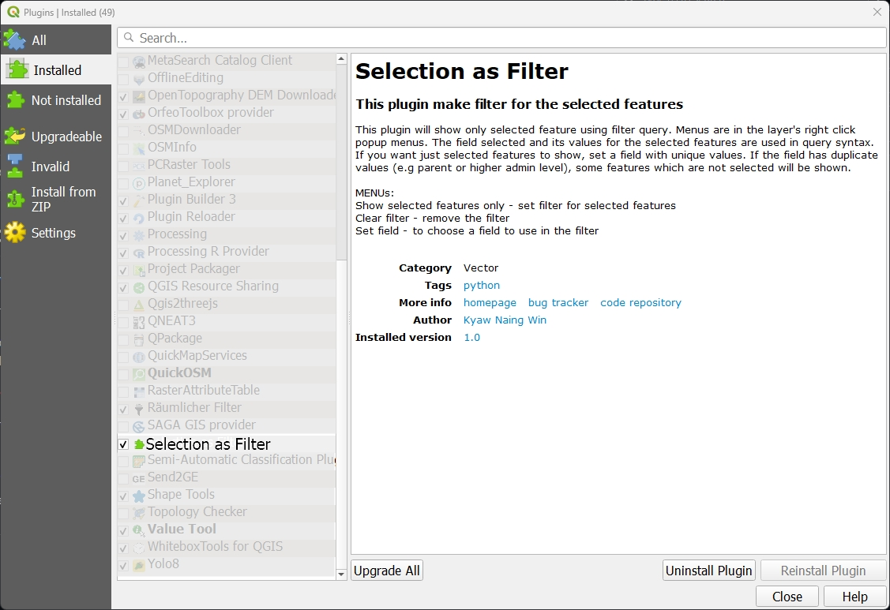
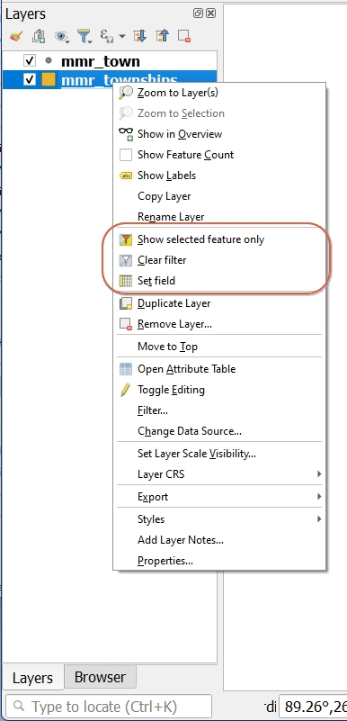
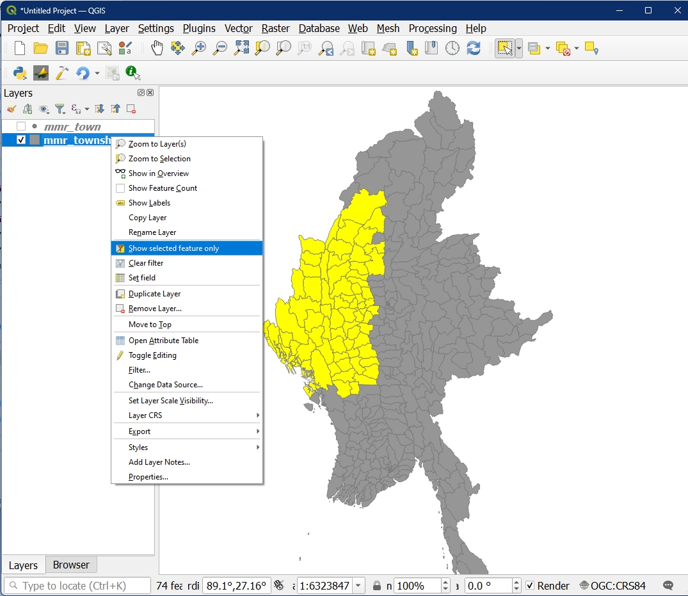
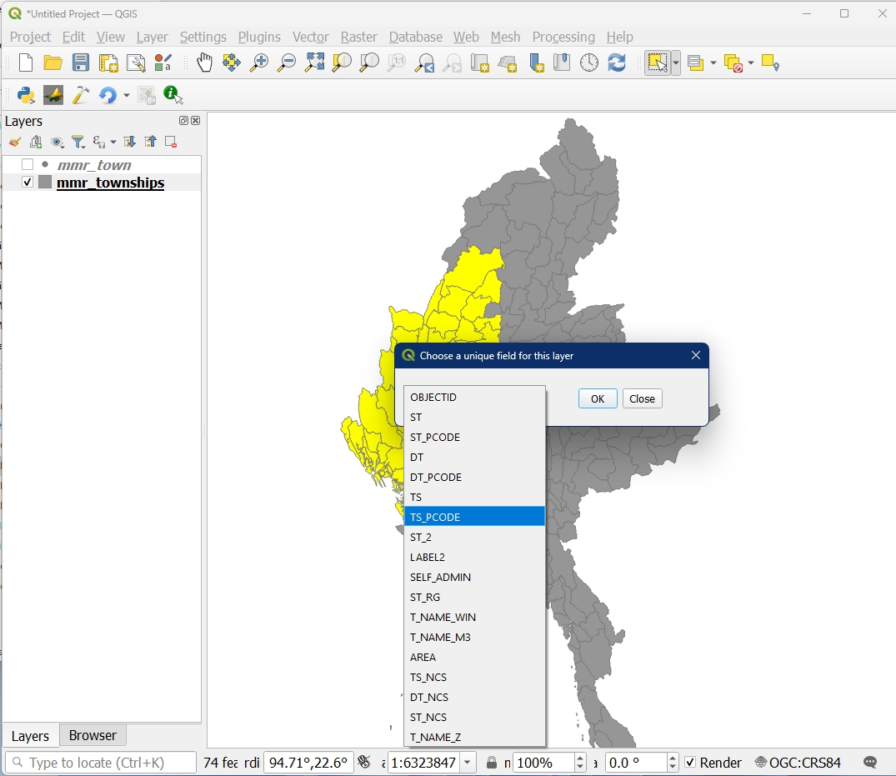
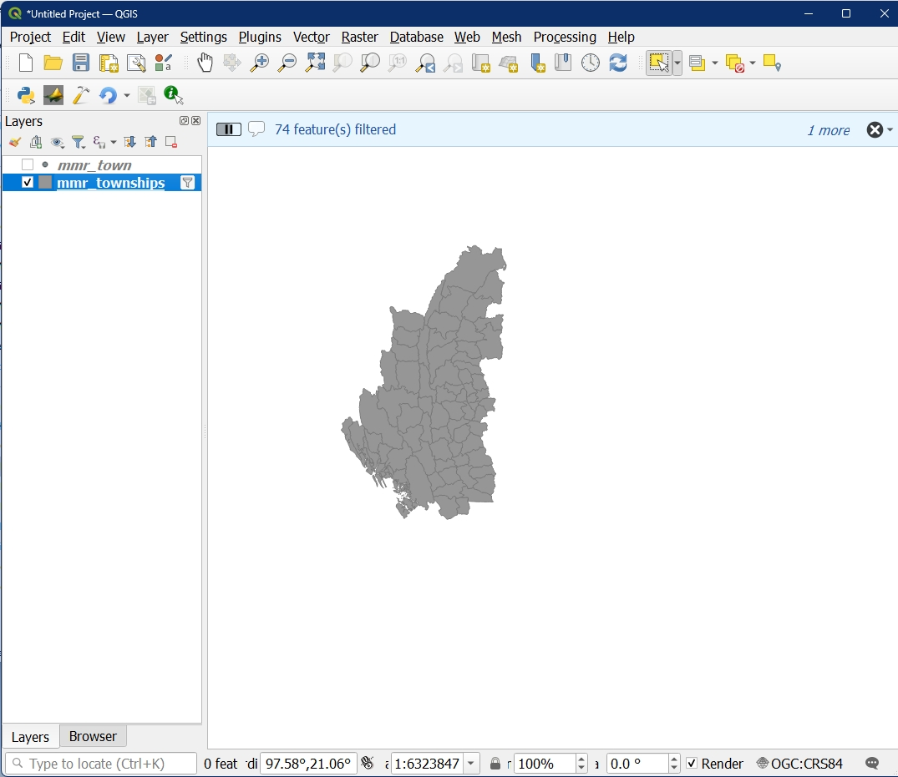
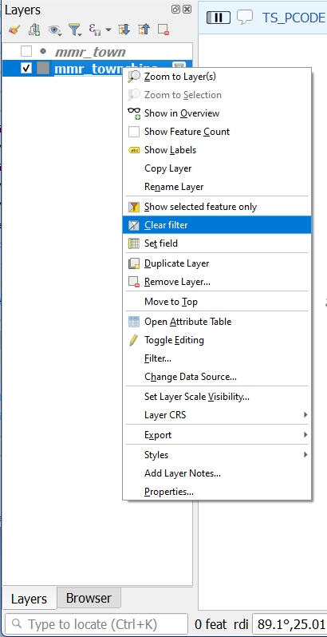
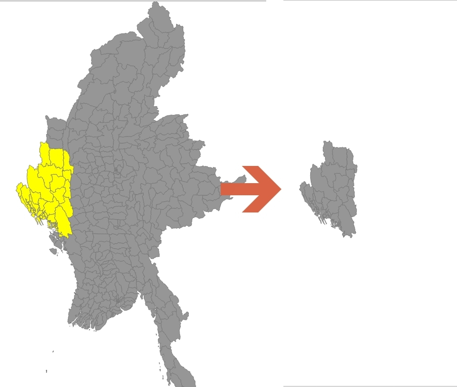
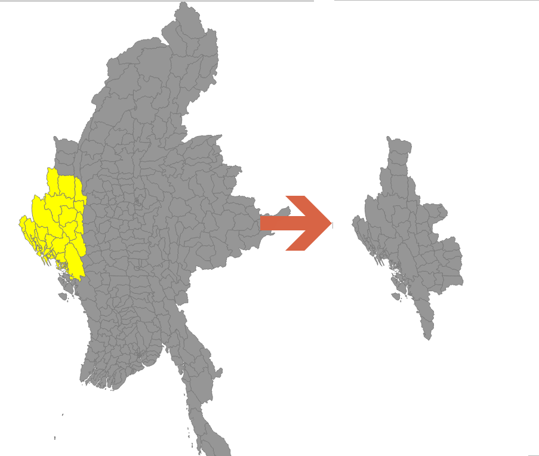

# Selection as Filter QGIS Plugin
 You know what you want to show from the layer visually and it is tedious work to write a query syntax manully for too many features that you can select by mouse.

 This plugin will allow you to select features and then make a filter on the layer to show just selected features.
 
 It uses a user selected field to use in the filter. If the field is with unique values, the exact selected features will be shown. If the field has duplicated values, then the result will include features that you do not selected.

 You can reset the field anytime.

Menus can be found in the layer's right click popup as follow
 - **Show selected features only** - set filter for selected features
 - **Clear filter** - remove the filter
 - **Set field** - to choose a field to use in the filter

*Note: this plugin do not use spatial query likw in  but use normal query syntax so that it works on any vector layers*

menus are in the layer's right click popup

with selection tool(s) or any selection methods, select your features and the click "Show selected features only" menu.

At first time, you will be asked to choose a field with which query will be constructed.

Voila!

You can remove the filter

## Depend on the field you choose, result will be different.

When a unique id field is set to use, eaxct features being selected are filtered.

When a parent admin field is set to use in the fiter, all the childern of the parent are filtered.

